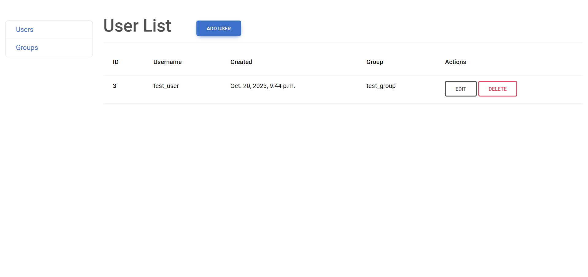
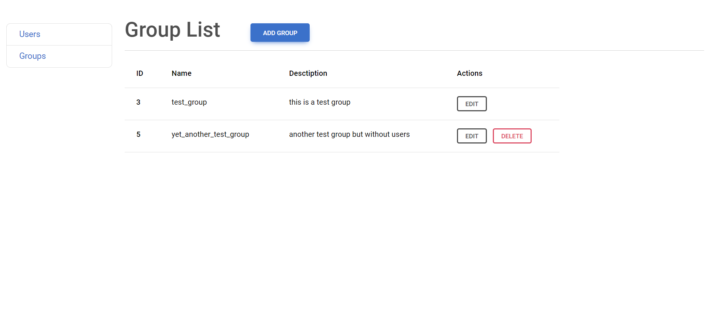

# Users and Groups Django Project

Test Task for VNV Solutions

## Installing via GitHub
```shell
git clone https://github.com/eduardhabryd/vnv_test_task.git
cd vnv_test_task
python -m venv venv
source venv/bin/activate # or venv\Scripts\activate in Windows
pip install -r requirements.txt
python manage.py migrate
python manage.py runserver
```


## Features

- Endpoints:
  - users/
    - users/create - for creating new user
    - users/<pk>/update - for updating user
    - users/<pk>/delete - for deleting user
  - groups/
    - groups/create - for creating new group
    - groups/<pk>/update - for updating group
    - groups/<pk>/delete - for deleting group

- Can't delete group if users are in it

## Demo
___
#### User List

#### Group List
